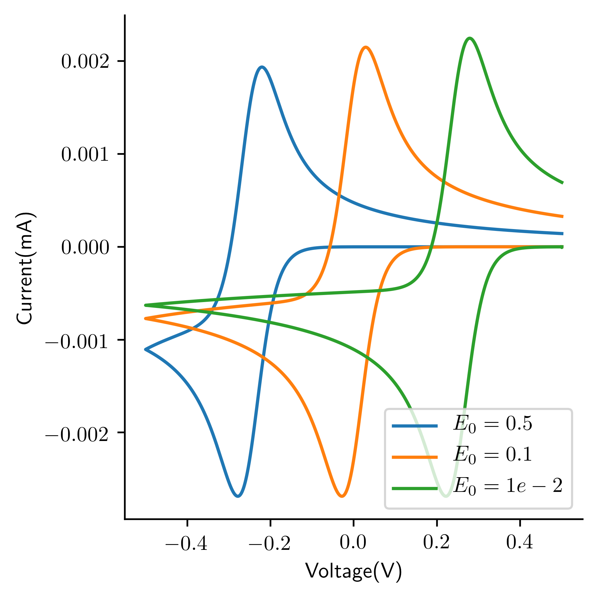

Python Cyclic Voltammetry Simulation Software
=======================================
This is a python wrapper for [MECSim](http://www.garethkennedy.net/MECSim.html) software.
It works completely in python in a Linux environment. I wrote this while working on [GPCV](https://github.com/kiranvad/gpcv) related work. 

If you use this software in your work please cite the original MECSim software along with this repository:
```bibtex
@misc{pymecsim,
    author       = {Kiran Vaddi},
    title        = {{pyMECSim: A Python wrapper for MECSim}},
    month        = April,
    year         = 2020,
    version      = {1.0},
    publisher    = {github},
    url          = {https://github.com/kiranvad/pyMECSim}
    }
```
To install as a package, run
```bash
pip install git+https://github.com/kiranvad/pyMECSim#egg=pyMECSIM.` 
```
Dependencies will be checked and installed from the setup.py file.

To install the package locally:
```bash
git clone https://github.com/kiranvad/pyMECSim.git
cd pyMECSim
pip install -e .

```
There are two modes of usages:

## Mode 1: Using pymecsim experiment interface
```python
from pymecsim import * 

A = Specie('A', C0=1e-6)
B = Specie('B')
C = Specie('C')
D = Specie('D')
species = [A, B, C, D]

R1 = ChargeTransfer([(A,1),('e',1)],[(B,1)],E0=0.0, ks=1.0e1)
R2 = ChemicalReaction([(B,1),(C,1)],[(A,1),(D,1)], kf=1e8, kb=1e-5)

rxn = [R1, R2]

mech = Mechanism(rxn)
print(mech)

cv = DCVoltammetry(E_start = 0.5, E_rev=-0.5, nu=1.0e0)
volt = Voltammetry(objs=[cv])

exp = Experiment(mech, voltammetry=volt)

sim = MECSIM(exp=exp)
sim.plot() # plot the simulated CV curve
```

## Mode 2: Using MECSim configuration file
If you are familiar with original MECSim software and its configuaraton files (.inp), you can also pass it as an input.
Import `pymecsim` using the following: 
```python
from pymecsim import MECSIM, pysed
```
We can perform a simulation on a one electron transfer mechanism and visualize the effect of changing the formal potential using the following code:

```python
import matplotlib.pyplot as plt
import numpy as np
import os

configfile  = '../mechanisms/cvexamples.sk'
E0 = [-0.25,0.0,0.25]
fig = plt.figure(figsize = (4,4))
ax = fig.add_subplot(111)
dirname = os.getcwd()
for i,e0 in enumerate(E0):
    outfile = dirname + '/outfile.sk'
    pysed('$E0', str(e0), configfile, outfile)
    model = MECSIM(configfile=outfile)
    ax = model.plot(ax = ax)
    ax.set_label("E0 = "+str(e0))
plt.legend([r'$E_0=0.5$',r'$E_0=0.1$',r'$E_0=1e-2$'],loc='lower right')
plt.show()
```

This will plot the following:



## Notebooks
This repository is shipped few useful [notebooks](https://github.com/kiranvad/pyMECSim/tree/master/notebooks).
* [Cyclic Voltammetry Simulation Example for Single Electron Transfer Mechanism](https://github.com/kiranvad/pyMECSim/blob/master/notebooks/Basic%20Usage.ipynb) -- that exaplains all the possible use cases of the simulator on a simple one electron transfer mehcanism
* [Kinetic Zone Diagram](/notebooks/Kinetic%20Zone%20Diagram.ipynb) -- exmaple explaining how to generate various CV curves in the [kinetic zone diagram](https://www.nature.com/articles/s41570-017-0039/figures/2)
* [Langmuir isotherm](/notebooks/Langmuir%20Isotherm.ipynb)-- example with modelling surface reactions and reproducing the Langmuir isotherm assumption

## Notes
* Please free to contribute to this repository both interms of code and documetation or simple example use cases in jupyter notebook. 
Submit a pull request and I would be happy to integrate into this repository.

* `api.md` contains the detailed API of pymecsim (under construction)


